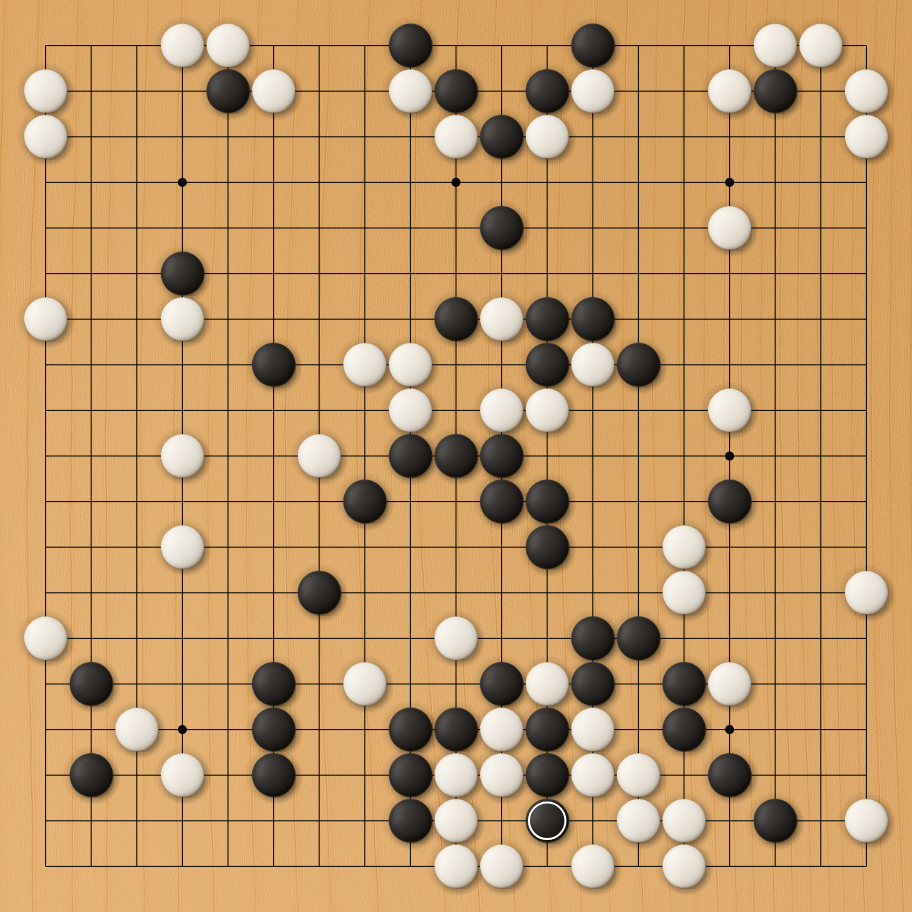

# MCTS visualization sample 5

"Snakebite" by [kendfrey](http://kendallfrey.com/): White to play. What is the result? (It was posted on 2025-07-01, in the `#game-analysis` channel of the "Computer Go Community" Discord server.)

This puzzle goes beyond the usual atari-atari problems. Give it a try!

Original SGF
[link1](https://tinyurl.com/snakebite-sgf)
[link2](https://gist.githubusercontent.com/kendfrey/b30d5b0719f28b12992dc7c3d24de5c8/raw/c57acf5e67acd1a238e9d39ddc824f7aeef2933d/snakebite.sgf)

## Spoiler alert

The author of this problem said:

> I want people who see this problem for the first time to have to think about it.

## Search diagrams (120k visits)

This is another demonstration of the "capture/rescue this stone" feature in LizGoban. The principal variation seems to have successfully picked up on key ideas in the puzzle, at least for one major branch. It took a lot of search to find the final tesuji, and the other variations are still unsolved.

* [Truncated diagram](https://kaorahi.github.io/visual_MCTS/sample5/snakebite_120kvisits_200nodes.html)
* [Less truncated diagram](https://kaorahi.github.io/visual_MCTS/sample5/snakebite_120kvisits_1600nodes.html)

(Press `i`/`o` to zoom. Click a node to view the continuation. If the board is hidden behind the information panel, try adjusting your browser window to be taller than it is wide.)

To experiment with this feature, check the release notes for [LizGoban 0.9.0](https://github.com/kaorahi/lizgoban/releases/tag/v0.9.0). See [sample4](https://github.com/kaorahi/visual_MCTS/tree/master/sample4) for the method used. (This example uses the 28b model, as the final tesuji is too hard for the 18b model. The MCTS "value" has been replaced entirely by the ownership at the square mark, without any "mixture".)

## Search diagrams (234k visits)

Further search unfortunately led the principal variation down an incorrect branch.

* [Truncated diagram](https://kaorahi.github.io/visual_MCTS/sample5/snakebite_234kvisits_200nodes.html)
* [Less truncated diagram](https://kaorahi.github.io/visual_MCTS/sample5/snakebite_234kvisits_1600nodes.html)

The author of this problem said:

> I did tweak the setup a little to lower the policy as much as I could. So you could say this is an adversarial puzzle.

(2025-07-04 in the "Snakebite" thread of the above Discord channel)
